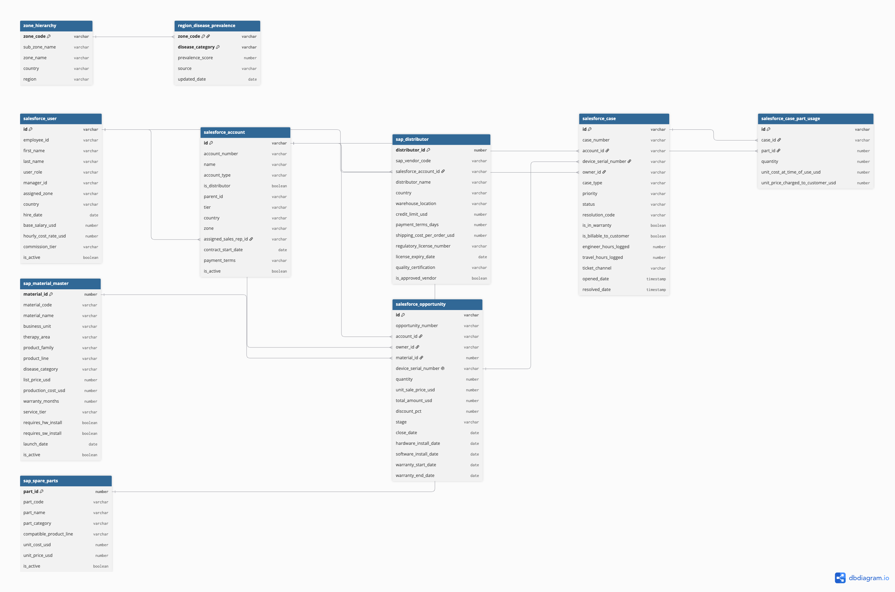
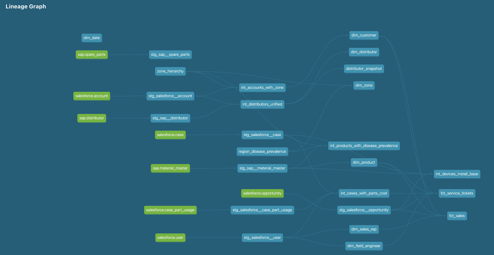
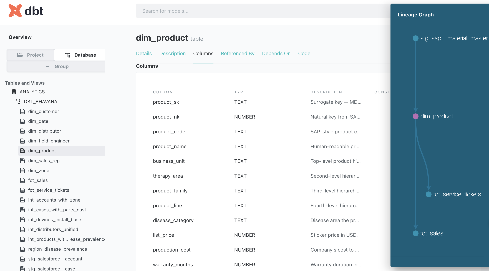
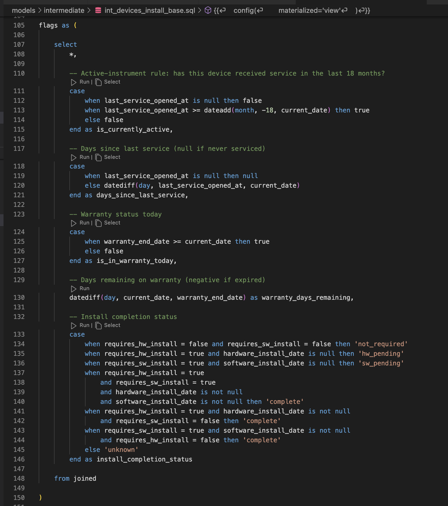

# Pharma Commercial Analytics — dbt + Snowflake

A production-grade analytics engineering project that models a pharmaceutical medical device company's commercial operations across 14 APAC markets. Built with dbt Core, Snowflake, and real domain logic borrowed from 8+ years of BI/analytics experience in pharma commercial reporting.

---

## The Story

Modern pharma commercial teams sit on data from Salesforce (CRM), SAP (ERP), and hand-maintained reference files. This project simulates that architecture end-to-end and models it as a modern data warehouse using dbt and Snowflake.

**What's real:**
- The pipeline shape mirrors a real production system I operated
- Business logic (18-month active-instrument rule, warranty economics, service-cost calculations, cross-system entity reconciliation) is drawn from actual pharma commercial analytics
- The domain hierarchy (business unit → therapy area → product family → product line) matches the 4-level structure common in medical device catalogs

**What's simulated:**
- All source data is synthetically generated via a seeded Python script (211K rows across 8 raw tables). Reproducible byte-for-byte from any clone of this repo
- No real client data is used, ever

**What it demonstrates:**
- End-to-end dbt architecture: sources → staging → intermediate → marts, with 22 models across 5 layers
- Real business logic in the intermediate layer, not just cosmetic transformations
- Star schema marts (7 dimensions + 2 facts) supporting real analytical queries
- SCD Type 2 snapshot on distributor with a verified change-detection demo
- Incremental materialization on the sales fact
- 108 data quality tests covering primary keys, referential integrity, and accepted values
- Auto-generated dbt documentation with column-level descriptions

---

## Architecture



Data flows from 3 source systems (Salesforce, SAP, hand-maintained CSVs) through 5 modeling layers into a star schema mart.

**Layer summary:**

| Layer | Count | Materialization | Purpose |
|---|---|---|---|
| Raw | 8 tables + 2 seeds | Table | Source system landing zone |
| Staging | 8 | View | Clean, rename, filter deleted records |
| Intermediate | 5 | View | Business logic + cross-source joins |
| Marts | 7 dims + 2 facts | Table (fct_sales: incremental) | Star schema for analytics |
| Snapshot | 1 | dbt Snapshot | SCD Type 2 on distributor |

---

## Live dbt Docs

[**→ Explore the live dbt documentation site**](https://YOUR-USERNAME.github.io/pharma-analytics-dbt/)

Browse all 22 models, click through the lineage graph, and read column-level descriptions on every mart.

*(Placeholder — link goes live after GitHub Pages setup.)*

---

## Key Portfolio Highlights

- **`int_devices_install_base`** — encodes the 18-month active-instrument rule, a real pharma commercial rule for classifying an install base as active or dark
- **`int_cases_with_parts_cost`** — computes service ticket economics (labor + parts + travel cost, customer revenue, net service cost)
- **`int_distributors_unified`** — reconciles the same distributor entity across SAP (supply-chain) and Salesforce (commercial) with a data-quality flag on name mismatches
- **`distributor_snapshot`** — verified SCD Type 2 with a live tier-change demo
- **`fct_sales`** — incremental materialization keyed on Salesforce `updated_at` watermark
- **Data quality tests** — 108 tests including PK uniqueness, FK relationships across marts, and accepted-values on every categorical column

---

## The Business Questions the Marts Answer

1. **Active install base health** — which devices are still active vs dark (18-month rule)?
2. **Distributor performance and service risk** — who's driving revenue, who's showing service warning signs?
3. **Sales rep productivity by zone** — which reps are outperforming, where's the coverage gap?
4. **Field service efficiency** — cost per ticket, in-warranty vs billable margins, resolution time by priority
5. **Launch opportunity mapping** — for a new device treating disease X, which zones combine high prevalence with low current sales?

---

## Pipeline Stats

- **211,560 rows** across 8 raw source tables
- **22 models** across staging, intermediate, and marts layers
- **108 data tests** — all passing
- **`dbt build`** runs the entire pipeline end-to-end in ~15 seconds

---

## Running Locally

```bash
# 1. Clone
git clone https://github.com/YOUR-USERNAME/pharma-analytics-dbt.git
cd pharma-analytics-dbt

# 2. Set up conda env
conda create -n dbt_env python=3.13
conda activate dbt_env
pip install -r requirements.txt

# 3. Generate synthetic source data
python data_generation/generate_all.py

# 4. Configure Snowflake credentials (see profiles.yml.example)
export SNOWFLAKE_USER='...'
export SNOWFLAKE_PASSWORD='...'
export SNOWFLAKE_ACCOUNT='...'

# 5. Load raw data
python data_loading/load_raw.py

# 6. Build the full pipeline
dbt seed
dbt run
dbt snapshot
dbt test
```

Or run everything at once:

```bash
dbt build
```

---

## Screenshots

**Lineage graph — the full DAG:**


**Column-level documentation on marts (dim_product):**


**Business logic in action — the 18-month active-instrument rule:**


---

## Tech Stack

- **Warehouse:** Snowflake
- **Transformation:** dbt Core 1.11
- **Language:** SQL (with Jinja templating) + Python for source data generation
- **Data quality:** dbt tests (generic + relationships)
- **Documentation:** dbt docs (auto-generated)

---

## About the Author

Bhavana Vangala — Senior BI / Data Analyst with 8+ years in pharma commercial analytics across Accenture, UseReady, and TCS. Building the analytics engineering muscle for the next chapter.

[LinkedIn](https://linkedin.com/in/vbhavanareddy)